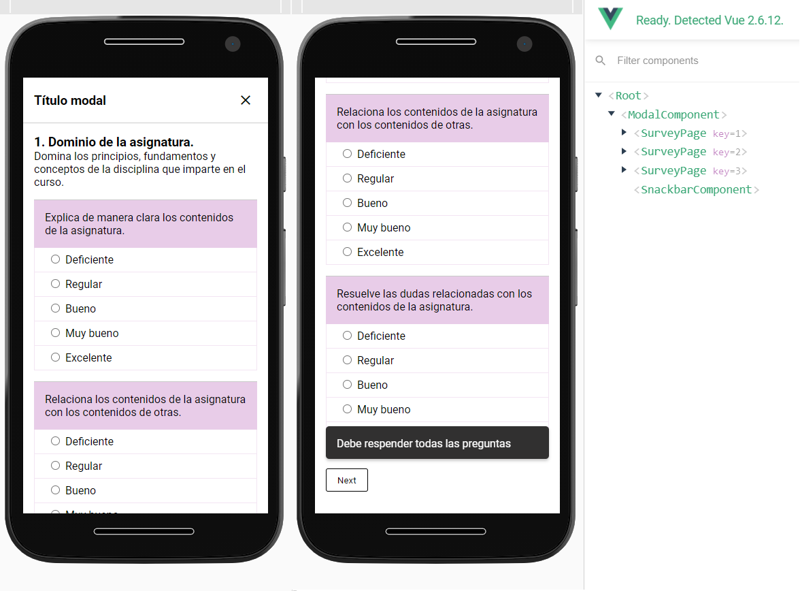

# Componentes de Encuesta

Desarrollado con [vue.js](https://vuejs.org/), son componentes para resolución de encuestas, de diseño responsivo.

- Modal
- Página de Encuesta (una encuesta puede tener varias páginas)
- Radio inputs (tipo de preguntas)
- Snackbar

## Capturas

~~1-2019/independiente/tests-miscelanius/survey~~
